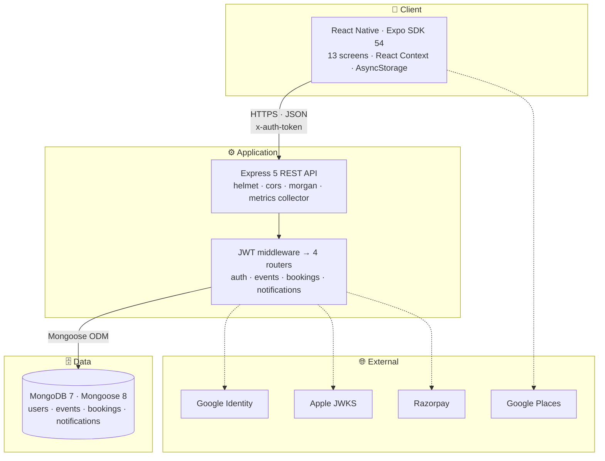

<div align="center">

# 🐝 EventHive

**A full-stack event discovery, hosting, and ticketing platform for your city.**

React Native (Expo) mobile client · Node.js/Express REST API · MongoDB · Docker · Kubernetes · CI/CD

*B.Sc. Computer Science — Final Semester Capstone Project*

[](#-testing--performance)
[](./docs/testing-and-performance.md)
[](./docs/testing-and-performance.md#static-analysis)
[](./docs/validation-report.md)
[](./LICENSE)
[](./backend)
[](./mobile-app)
[](./docs/database.md)

**📚 [Full Documentation](./docs/README.md)** · [Architecture](./docs/architecture.md) · [Database](./docs/database.md) · [Backend](./docs/backend.md) · [API](./docs/api-reference.md) · [Mobile](./docs/mobile-app.md) · [Testing](./docs/testing-and-performance.md) · [Setup](./docs/setup-and-deployment.md) · [User Manual](./docs/user-manual.md) · [Validation](./docs/validation-report.md)

</div>

---

## 📋 Table of contents

- [Problem statement](#-problem-statement)
- [What the system does](#-what-the-system-does)
- [Architecture at a glance](#-architecture-at-a-glance)
- [Tech stack](#-tech-stack)
- [Quick start](#-quick-start)
- [Testing & performance](#-testing--performance)
- [Engineering practices](#-engineering-practices)
- [Repository structure](#-repository-structure)
- [Documentation](#-documentation)
- [Known limitations](#-known-limitations)
- [Licence & attribution](#-licence--attribution)

---

## 🎯 Problem statement

Finding local events that match a specific interest — a tech workshop, a neon party, a cooking
class — is fragmented across ticketing sites, social posts, and word of mouth. Independent hosts,
meanwhile, face a choice between high-commission platforms and improvised sign-up forms.

**EventHive is a single mobile marketplace serving both sides:**

- **Attendees** discover events filtered by city, category, date, and age suitability; book in a
  tap; and carry a QR ticket in the app.
- **Hosts** publish an event in one flow, manage a live guest list, and scan attendees in at the
  door.

---

## ✨ What the system does

<table>
<tr><td width="50%" valign="top">

**🔐 Authentication — four paths, one session**
- Email/password with bcrypt (10 salt rounds)
- Google Sign-In (OAuth 2.0 `id_token` verification)
- Apple Sign-In (JWKS `RS256` verification)
- Guest browsing mode
- All paths converge on a 5-day HS256 JWT

**🔎 Discovery**
- Paginated feed with a featured carousel
- Four filters — city, category, date range, age group
- Free-text search
- Past events filtered out automatically

**🎫 Booking**
- Two-phase checkout (order → verify), so no booking is written until payment returns
- Free events skip the gateway entirely
- Registration-deadline enforcement at **both** phases
- Live inventory decrement
- Razorpay integration with a development mock fallback

</td><td width="50%" valign="top">

**📱 Ticketing & check-in**
- Unique ticket code per booking, rendered as a scannable QR
- Host-side camera scanner (`expo-camera`)
- Idempotent check-in — a second scan is rejected
- Event-scoped validation: a valid ticket for a *different* event is refused

**🛠 Hosting**
- Full event creation: poster upload, Google Places autocomplete, custom snapping date-time picker, capacity, pricing, intro video, age targeting
- External-ticketing mode for events sold elsewhere
- Live guest list with check-in status

**🔔 Notifications**
- Booking confirmations
- Check-in alerts to both guest and host
- Cancellation notices to every attendee
- **City-based announcements** when an event is posted in your city

</td></tr>
</table>

---

## 🏗 Architecture at a glance



A two-tier client/server system — the mobile app is the only client, and it speaks to the backend
exclusively over a JSON REST API. **20 endpoints**, **4 collections**, **13 screens**.

📖 **[Full architecture, request lifecycle, and design trade-offs →](./docs/architecture.md)**

---

## 🛠 Tech stack

<table>
<tr><th align="left">Layer</th><th align="left">Technology</th></tr>
<tr><td><b>Mobile</b></td><td>React Native 0.81 · Expo SDK 54 · React 19 · React Navigation 7 · Reanimated 4 · Axios · AsyncStorage · <code>expo-image</code> · <code>expo-camera</code> · <code>react-native-qrcode-svg</code> · Plus Jakarta Sans</td></tr>
<tr><td><b>Backend</b></td><td>Node.js 20 · Express 5 · Mongoose 8 · JWT · bcryptjs · <code>express-validator</code> · helmet · cors · morgan</td></tr>
<tr><td><b>Database</b></td><td>MongoDB 7 (Atlas)</td></tr>
<tr><td><b>Auth</b></td><td><code>google-auth-library</code> · <code>jwks-rsa</code> (Apple) · JSON Web Tokens</td></tr>
<tr><td><b>Payments</b></td><td>Razorpay</td></tr>
<tr><td><b>Testing</b></td><td>Jest 30 · Supertest 7 · ESLint 9 · custom load-benchmark harness</td></tr>
<tr><td><b>DevOps</b></td><td>Docker · Kubernetes · GitHub Actions · Render</td></tr>
</table>

---

## 🚀 Quick start

<details open>
<summary><b>1 · Backend</b></summary>

```bash
cd backend
npm install
```

Create `backend/.env`:

```env
PORT=5000
MONGO_URI=mongodb+srv://<user>:<pass>@<cluster>.mongodb.net/eventhive
JWT_SECRET=<a long random string>
```

No MongoDB to hand? `docker run -d -p 27017:27017 --name eventhive-mongo mongo:7`

```bash
node seedEvents.js     # optional — 3 demo hosts, 18 events
npm run dev            # → http://localhost:5000
curl http://localhost:5000/health
```

</details>

<details open>
<summary><b>2 · Mobile app</b></summary>

```bash
cd mobile-app
npm install
```

Create `mobile-app/.env`:

```env
EXPO_PUBLIC_API_URL=http://localhost:5000/api
EXPO_PUBLIC_GOOGLE_MAPS_API_KEY=<google places key>
```

```bash
npx expo start         # scan the QR with Expo Go
```

`localhost` is fine here — on a physical device the API client automatically substitutes your
machine's LAN IP.

</details>

<details>
<summary><b>3 · Demo credentials</b> (after seeding)</summary>

| Email | Password | City |
| :--- | :--- | :--- |
| `rohit@example.com` | `rohit123` | Bengaluru |
| `virat@example.com` | `virat123` | Mumbai |
| `jasprit@example.com` | `jasprit123` | Mumbai |

</details>

📖 **[Full setup, Docker, Kubernetes, CI/CD, and troubleshooting →](./docs/setup-and-deployment.md)**

---

## 🧪 Testing & performance

### Automated tests — 16 integration tests, 4 suites

True integration tests: the real Express app is mounted in-process via Supertest and exercised
against a real MongoDB. **Nothing is mocked.**

| Suite | Tests | Covers |
| :--- | :---: | :--- |
| `tests/server.test.js` | 1 | Health endpoint |
| `tests/checkin.test.js` | 4 | QR check-in success + authorisation, idempotency, invalid-ticket failures |
| `tests/deadlines.test.js` | 5 | Registration-deadline enforcement across both booking phases; age-group validation |
| `tests/notifications.test.js` | 6 | All four notification triggers + read-state mutations |
| **Total** | **16** | |

```bash
cd backend
npm run lint     # ESLint 9 — currently 0 errors, 0 warnings
npm test         # 4 suites, 16 tests
```

Every push and pull request runs lint **and** the full suite against an ephemeral `mongo:7`
service container in GitHub Actions.

### Coverage — measured 2026-08-29 on `f9bdbcd`

| Metric | Covered / Total | % |
| :--- | :---: | :---: |
| Statements | 204 / 424 | 48.11 % |
| Branches | 62 / 181 | 34.25 % |
| Functions | 18 / 38 | 47.36 % |
| Lines | 200 / 401 | 49.87 % |

All four Mongoose models are at **100 %**, and the three non-trivial flows — booking, check-in,
notification fan-out — are covered end to end. The gap is concentrated in `routes/auth.js`
(12.69 %), where the federated Google/Apple handlers cannot run without live provider tokens.
Full breakdown and an honest reading in **[Validation Report §9.3](./docs/validation-report.md)**.

```bash
cd backend && npm run test:coverage
```

### Measured performance

> Figures below are read from **[`backend/tests/benchmark_results.json`](./backend/tests/benchmark_results.json)** —
> a committed artefact of an actual run of `backend/tests/benchmark.js`. **1,164 requests issued,
> 100% success rate, zero timeouts.**

**Baseline latency (no load)**

| Endpoint | Mean | P50 | P95 |
| :--- | ---: | ---: | ---: |
| `GET /health` — routing + middleware only | **4.83 ms** | 2.97 ms | 24.50 ms |
| `GET /api/events?page=1&limit=30` — DB-backed | **263.74 ms** | 239.39 ms | 709.71 ms |

**Routing layer under concurrency — scales cleanly**

| Concurrent users | Mean | P95 | Throughput | Success |
| :---: | ---: | ---: | ---: | :---: |
| 10 | 5.27 ms | 14.47 ms | 1,204 req/s | 100% |
| 50 | 7.42 ms | 13.72 ms | 4,067 req/s | 100% |
| 100 | 9.30 ms | 14.29 ms | 7,032 req/s | 100% |
| **200** | **17.21 ms** | **25.75 ms** | **7,896 req/s** | **100%** |

**Database-backed feed under concurrency — throughput-limited**

| Concurrent users | Mean | P95 | Throughput | Success |
| :---: | ---: | ---: | ---: | :---: |
| 2 | 400 ms | 582 ms | 4.23 req/s | 100% |
| 5 | 985 ms | 1,776 ms | 3.29 req/s | 100% |
| 10 | 1,851 ms | 2,883 ms | 3.61 req/s | 100% |
| **15** | **3,242 ms** | **3,886 ms** | 3.83 req/s | **100%** |

**The key finding.** Latency grows linearly with concurrency while throughput stays flat — the
signature of a fully serialised resource. The bottleneck was located arithmetically rather than by
guesswork:

```
baseline service time  = 263.74 ms
predicted ceiling      = 1000 / 263.74 = 3.79 req/s
observed               = 3.29 – 4.23 req/s   ✓
```

Each additional concurrent user adds a fixed **~200 ms** to everyone's wait. The cost is a remote
Atlas round-trip plus a **second** round-trip from Mongoose `populate('host')`, not payload
serialisation. The application server is **2,062× faster** on the same middleware stack when the
database is not involved.

📖 **[Full methodology, bottleneck analysis, mobile profiling, and 12 prioritised recommendations →](./docs/testing-and-performance.md)**

### Optimisations shipped

Each diagnosed bottleneck has a corresponding change in the codebase:

| Optimisation | Addresses | Commit |
| :--- | :--- | :--- |
| Backend feed pagination with field projection | Payload size, client parse cost | `4184ea1` |
| Client requests the feed paginated (`limit=30`) | Hermes GC pauses of 80–150 ms | `eb9f587` |
| Posters render via `expo-image` with disk caching | Re-download and re-decode on every scroll pass | `71dd136` |
| Android-tuned list entrance animations | Per-cell spring math missing the 16 ms frame budget | `e8667ce` |
| Notification polling removed | A 10-second JS-thread wake for the whole session | `6387f2e` |
| Auth context memoised, redirect URI hoisted | Whole-tree re-renders, an auth render loop | `c583124` |

---

## 🔧 Engineering practices

**CI — two sequential gates, fail-closed**

```
push / PR → main
  └─ quality-check    ESLint → 16 Jest tests against an ephemeral mongo:7 service container
```

Both gates run on every push **and** every pull request. Lint runs first, so a failure there stops
the job before the test step. The MongoDB service container is health-gated, so tests never start
against a database that is not yet accepting connections.

Containerisation (`backend/Dockerfile`) and the Kubernetes manifests (`backend/k8s/`) are maintained
and applied manually rather than from CI.

**Security**
- bcrypt password hashing, 10 salt rounds; `password` stripped from every response
- Identical error for unknown email and wrong password — no user enumeration
- `helmet` security headers on every response
- Federated tokens verified against the provider, then discarded — never stored
- Explicit field projections on every `populate` so host records cannot leak `bankDetails`
- Ownership re-checked from the database on every privileged operation

**Observability**
- `/health` — dependency-free liveness probe
- `/api/metrics` — per-route request counts and average latency, plus live RSS/heap; this is what
  the benchmark harness reads to correlate latency with memory

**Testability**
- The Express app is exported **without binding a port** (`if (require.main === module)`), so both
  Supertest and the benchmark harness mount the real application in-process with zero lifecycle
  management

---

## 📂 Repository structure

```
EventHive/
├── backend/                    Node.js + Express REST API
│   ├── src/
│   │   ├── server.js           App, middleware chain, metrics collector
│   │   ├── config/db.js        Mongoose connection (fails fast)
│   │   ├── middleware/auth.js  JWT verification
│   │   ├── models/             User · Event · Booking · Notification
│   │   └── routes/             auth · events · bookings · notifications
│   ├── tests/                  4 Jest suites + benchmark harness + benchmark & coverage results
│   ├── k8s/                    Deployment + Service manifests
│   ├── seedEvents.js           3 hosts, 18 events across every category
│   ├── keep_alive.js           Render cold-start ping
│   └── Dockerfile
├── mobile-app/                 React Native (Expo SDK 54) client
│   └── src/
│       ├── screens/            13 screens
│       ├── navigation/         Stack + tab graph
│       ├── context/            AuthContext · NotificationContext
│       ├── components/         GlassCard · GradientButton · CustomTabBar · CustomInput
│       ├── constants/theme.js  "Aurora" design tokens
│       └── services/api.js     Axios with dynamic base-URL resolution
├── docs/                       Technical documentation (10 chapters)
├── LICENSE                     MIT
├── THIRD_PARTY_NOTICES.md      Dependency licences and attributions
└── .github/workflows/          CI/CD pipeline
```

---

## 📚 Documentation

Full technical documentation lives in **[`docs/`](./docs/README.md)**.

| Chapter | Contents |
| :--- | :--- |
| **[1 · Architecture](./docs/architecture.md)** | System topology, request lifecycle, authentication model, deployment topology, design trade-offs, known limitations |
| **[2 · Database](./docs/database.md)** | ER diagram, all four schemas field-by-field, relationships and population strategy, index analysis, seeding |
| **[3 · Backend](./docs/backend.md)** | Middleware chain, auth flows, event management, the two-phase booking sequence, notification fan-out, check-in, observability |
| **[4 · API Reference](./docs/api-reference.md)** | All 20 endpoints — request bodies, response shapes, every error code, cURL examples |
| **[5 · Mobile App](./docs/mobile-app.md)** | Navigation graph, all 13 screens, state management, API client resolution, design system, client optimisations |
| **[6 · Testing & Performance](./docs/testing-and-performance.md)** | Test inventory, benchmark methodology, measured results, bottleneck analysis, mobile profiling, recommendations, reproduction guide |
| **[7 · Setup & Deployment](./docs/setup-and-deployment.md)** | Environment variables, local setup, demo walkthrough, Docker, CI/CD, Kubernetes, Render, troubleshooting |
| **[8 · User Manual](./docs/user-manual.md)** | End-user guide — sign-up, discovery and filtering, booking, the QR ticket, hosting, door check-in, troubleshooting |
| **[9 · Validation Report](./docs/validation-report.md)** | Dated test-execution record, code coverage, static analysis, performance validation, 27-row requirements traceability matrix |
| **[10 · Originality & Compliance](./docs/originality-and-compliance.md)** | Declaration of originality, plagiarism-scan procedure, disclosed scaffolding and AI use, licensing and attribution checklist |

---

## ⚠️ Known limitations

Documented deliberately — each is a real property of the code as committed, with the fix identified.
Full detail in **[Architecture §1.8](./docs/architecture.md#18-known-limitations--future-work)**.

| # | Limitation | Fix |
| :---: | :--- | :--- |
| 1 | **Inventory decrement is not atomic** — a read-compare-write can oversell the last ticket under concurrency | Single `findOneAndUpdate` with `$inc` and an `inventory: { $gte: qty }` guard |
| 2 | **Razorpay signature verification is commented out** — payments are mock-verified | Re-enable the HMAC-SHA256 comparison in `/api/bookings/verify` |
| 3 | **Posters are stored as base64 inside MongoDB documents** — hence the `50mb` body limit | Wire up the already-installed `cloudinary` dependency and store URLs |
| 4 | **`Event.startDate` is unindexed** despite being the feed's sort key | `EventSchema.index({ startDate: 1 })` |
| 5 | **`NotificationContext` is stubbed client-side** to remove a 10 s polling loop; the backend API is complete and tested | Reconnect via `expo-notifications` push |
| 6 | **Guest mode has no server session** — authenticated calls as a guest return 401 | Issue a scoped guest token |
| 7 | **`GET /api/metrics` is unauthenticated** | Add the auth middleware |
| 8 | **k8s `memory: 256Mi` is below the measured RSS floor** of 211.72 MB | Raise to `512Mi`; add liveness/readiness probes on `/health` |

---

## 📜 Licence & attribution

EventHive is released under the **[MIT License](./LICENSE)** © 2026 Ishan Avasthi.

All third-party dependencies are consumed unmodified from the public npm registry and enumerated
with their licences in **[`THIRD_PARTY_NOTICES.md`](./THIRD_PARTY_NOTICES.md)** — 14 backend and 44
mobile direct dependencies, plus a transitive audit of all 1,593 tree entries. Every licence present
is permissive or weak-copyleft; **no GPL/AGPL package is linked into either distributable.**

Originality declarations, the plagiarism-compliance procedure, and disclosed scaffolding are in
**[Originality & Compliance](./docs/originality-and-compliance.md)**. Local similarity scans —
**4.13 %** internal code duplication (jscpd, all clones internal to this repository) and **0.42 %**
documentation self-duplication — are reported in
**[`docs/compliance/`](./docs/compliance/similarity-scan-local.md)**.

---

<div align="center">

**EventHive** — B.Sc. Computer Science Capstone Project

[Documentation](./docs/README.md) · [User Manual](./docs/user-manual.md) · [API Reference](./docs/api-reference.md) · [Validation Report](./docs/validation-report.md)

</div>
