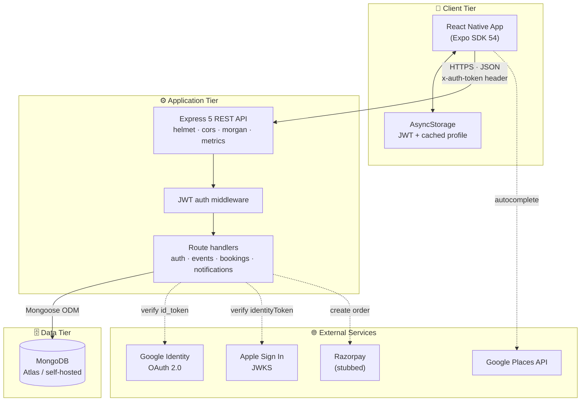
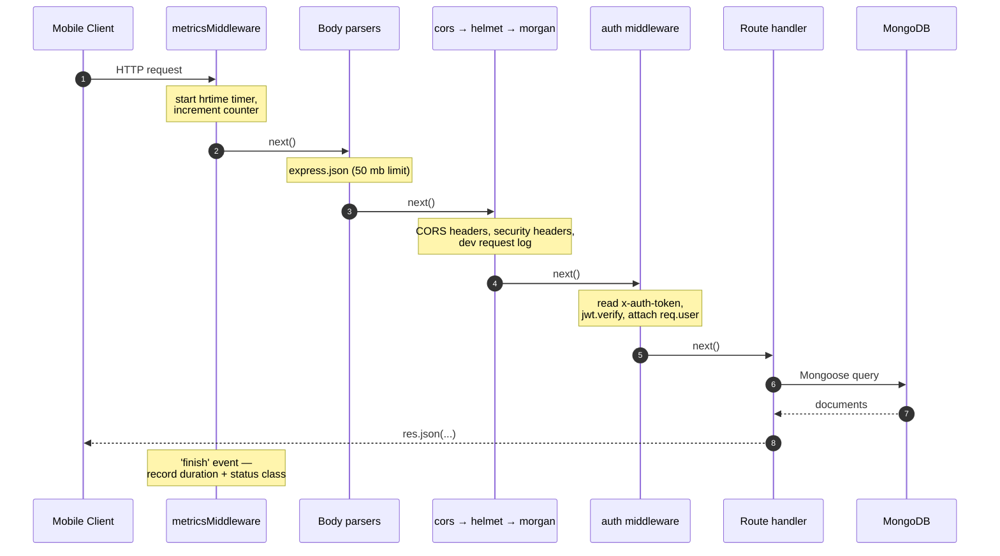
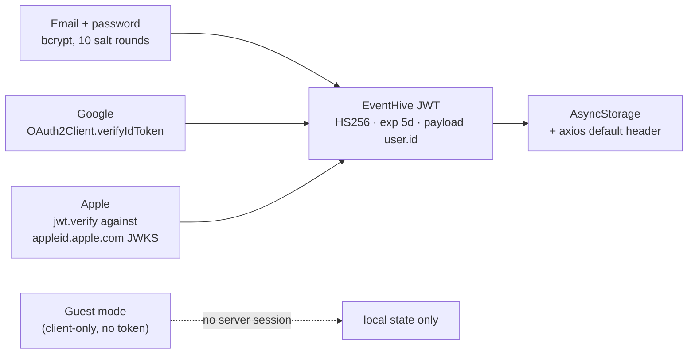
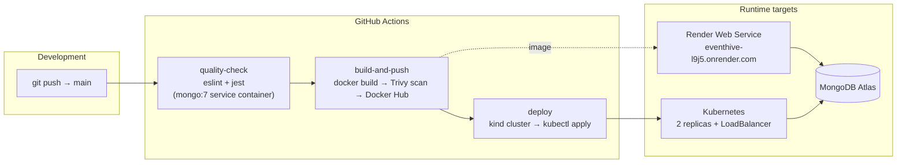

# 1. Architecture

← [Docs index](./README.md) · Next: [Database](./database.md)

---

## 1.1 System overview

EventHive is a **two-tier client/server system** with a third-party service layer. There is no
web frontend — the mobile app is the only client, and it speaks to the backend exclusively over a
JSON REST API.



### Tier responsibilities

| Tier | Technology | Responsibility |
| :--- | :--- | :--- |
| **Client** | React Native 0.81 / Expo SDK 54 | Rendering, navigation, local session cache, client-side filtering, QR generation and scanning |
| **Application** | Node.js 20 / Express 5 | Request validation, authentication, authorisation, business rules, notification fan-out |
| **Data** | MongoDB 7 via Mongoose 8 | Persistence of users, events, bookings, notifications |
| **External** | Google, Apple, Razorpay | Federated identity, place autocomplete, payment order creation |

---

## 1.2 Request lifecycle

Every request through the backend follows the same ordered pipeline, defined in
`backend/src/server.js`:



The `metricsMiddleware` is registered **first** so that its `res.on('finish')` hook measures the
full end-to-end handler time. The accumulated data is exposed at `GET /api/metrics` and is what the
load benchmark reads to correlate latency with process memory.

`auth` is **not** global — it is applied per-route, so public endpoints
(`GET /api/events`, `GET /health`) skip it entirely.

---

## 1.3 Backend module structure

```
backend/src/
├── server.js          Express app, middleware chain, metrics, route mounting
├── config/
│   └── db.js          connectDB() — single Mongoose connection, fails fast on error
├── middleware/
│   └── auth.js        Verifies the x-auth-token JWT, attaches req.user = { id }
├── models/            Mongoose schemas — the only place field shapes are declared
│   ├── User.js
│   ├── Event.js
│   ├── Booking.js
│   └── Notification.js
└── routes/            One Express Router per resource
    ├── auth.js        register · login · google · apple · profile
    ├── events.js      create · list · detail · delete · guests · check-in
    ├── bookings.js    checkout · verify · my-bookings
    └── notifications.js  list · mark-read · mark-all-read
```

There is no separate service or repository layer. Business logic lives inside the route handlers —
a deliberate choice for a project of this size, discussed in §1.7.

### The testability seam

`server.js` ends with:

```js
if (require.main === module) {
  connectDB();
  app.listen(PORT, '0.0.0.0', …);
}
module.exports = app;
```

This is the single most important structural decision in the backend. Because the app is exported
without binding a port, **Supertest can mount it in-process** for integration tests, and the
benchmark harness can `app.listen()` on its own port. No test needs to shell out to a running
server or manage its lifecycle.

---

## 1.4 Authentication architecture

Four sign-in paths converge on **one** session representation: a locally-issued HS256 JWT
carrying `{ user: { id } }`, valid for 5 days.



Key properties:

- **Federated tokens are exchanged, never stored.** A Google `id_token` or Apple `identityToken` is
  verified once against the provider, then discarded; the client only ever holds an EventHive JWT.
- **First federated login auto-provisions a user** with a random bcrypt-hashed password, so the
  `User.password` `required` constraint holds without ever giving the account a usable password.
- **Authorisation is ownership-based, not role-based.** The `role` field exists on `User` but is
  unused. Every privileged action re-reads the resource and compares
  `resource.host.toString() === req.user.id`.
- **The token is transported in a custom `x-auth-token` header**, not `Authorization: Bearer`.

See [Backend §3.2](./backend.md#32-authentication) for the full flow.

---

## 1.5 Data flow: the three core journeys

### Discovery

```
HomeScreen mounts
  → GET /api/events?page=1&limit=30
  → server: Event.find().select('-description -videoUrl').skip(0).limit(30)
            .populate('host', [name, email, profilePicture, userType]).sort({ startDate: 1 })
  → client caches the page in state
  → all filtering (city, category, date range, age group, text search) runs client-side
```

Filtering is intentionally client-side: the page is capped at 30 documents, so filtering in JS is
instantaneous and avoids a round-trip per filter tap. The trade-off is that filters only apply
within the loaded page — see §1.8.

### Booking

```
EventDetailsScreen "Book Now"
  → POST /api/bookings/checkout   (validates deadline, host self-booking, inventory)
       ├─ free event   → { orderId: 'FREE_EVENT', amount: 0 }
       └─ paid event   → Razorpay order (or a mock order outside production)
  → POST /api/bookings/verify     (re-validates deadline + inventory)
       ├─ Event.inventory -= quantity
       ├─ Booking created with a unique ticketCode
       └─ Notification created for the attendee
  → BookingSuccessScreen → TicketScreen renders the ticketCode as a QR code
```

### Check-in

```
Host opens ManageEventScreen → Scanner tab (expo-camera)
  → scans the attendee's QR → POST /api/events/:id/checkin { ticketCode }
  → server: assert requester is host → find Booking by (event, ticketCode)
            → reject if already checkedIn → set checkedIn = true
            → create 2 notifications (attendee "Checked In", host "Guest Checked In")
```

---

## 1.6 Deployment architecture



The pipeline is **fail-closed at three gates**: lint must pass, all 16 tests must pass against a
real ephemeral MongoDB, and Trivy must find no `CRITICAL`/`HIGH` fixable vulnerabilities before the
image is pushed. Details in [Setup & Deployment §7.5](./setup-and-deployment.md#75-cicd-pipeline).

---

## 1.7 Design decisions and trade-offs

| Decision | Rationale | Trade-off accepted |
| :--- | :--- | :--- |
| **Logic in route handlers, no service layer** | 4 resources, ~20 endpoints. A service layer would add indirection without reducing complexity at this size. | Business rules (e.g. the deadline check) are duplicated across `checkout` and `verify`. |
| **Export the Express app without listening** | Enables in-process Supertest and benchmark harnesses with zero lifecycle management. | None material. |
| **Custom `x-auth-token` header** | Simple, avoids parsing the `Bearer` scheme. | Non-standard; incompatible with off-the-shelf API tooling that assumes `Authorization`. |
| **Ownership checks over RBAC** | Every privileged action in the domain is "is this your event?". A role matrix would be unused scaffolding. | Adding an admin/moderator persona later requires touching every guarded handler. |
| **Client-side filtering of a 30-item page** | Instant filter response, no network round-trip per tap. | Filters cannot reach events beyond the first page. |
| **Mongoose `populate` for host details** | Keeps the client from making N+1 requests for host names and avatars. | Adds a second query per list request — the dominant cost at load (see [Testing §6.4](./testing-and-performance.md#641-bottleneck-analysis)). |
| **JWT with a 5-day expiry, no refresh token** | Matches the session lifetime an event-booking app needs; avoids a token-rotation subsystem. | No server-side revocation; a leaked token is valid until it expires. |
| **In-process metrics collector rather than Prometheus** | Zero dependencies, and the benchmark harness can read it over HTTP. | Metrics reset on restart and are per-replica, so they do not aggregate across the 2 k8s pods. |

---

## 1.8 Known limitations & future work

These are documented deliberately. Each is a real property of the code as committed, not a
hypothetical.

### Correctness

1. **Inventory decrement is not atomic.**
   `backend/src/routes/bookings.js` reads `event.inventory`, compares, then writes
   `event.inventory -= quantity` and saves. Two concurrent bookings for the last ticket can both
   pass the check and oversell.
   *Fix:* a single `Event.findOneAndUpdate({ _id, inventory: { $gte: qty } }, { $inc: { inventory: -qty } })`.

2. **Razorpay signature verification is commented out.**
   The HMAC-SHA256 comparison in `/api/bookings/verify` is present but disabled, so any client can
   post an arbitrary `razorpay_payment_id` and receive a confirmed booking. Payments are effectively
   **mock-verified** in the current build. This is the single change required before real money
   could flow.

3. **`GET /api/metrics` is unauthenticated**, exposing process memory and per-route timings.

### Performance

4. **Event posters are stored as base64 data URIs inside the MongoDB document.**
   `CreateEventScreen` uploads with `base64: true` and sends `data:image/jpeg;base64,…` as the
   `poster` field — which is why `express.json` is configured with a `50mb` limit. The list
   projection excludes `description` and `videoUrl` but **not** `poster`, so every list response
   carries full image payloads. The `cloudinary` dependency is installed but unused; wiring it up
   and storing URLs instead is the highest-leverage single fix.

5. **`Event.startDate` is unindexed** despite being the sort key on every list query.

6. **`MyEventsScreen` fetches the unpaginated `GET /api/events`** and filters for hosted events
   client-side, defeating the pagination added elsewhere.

### Scope

7. **`NotificationContext` on the client is a stub.** It returns an empty list and no-op methods —
   it was stubbed to remove a 10-second polling loop that was costing battery and frame budget. The
   backend notification API is fully implemented and covered by 6 passing integration tests, and
   `NotificationsScreen` exists; only the provider needs reconnecting, ideally via push rather than
   polling.

8. **Guest mode is client-only.** It writes a synthetic user to AsyncStorage with no server session,
   so any authenticated call made as a guest will fail with 401.

9. **`loadUser()` trusts the cached profile** in AsyncStorage without re-validating the JWT against
   the server on launch, so a user whose token expired sees a logged-in shell until their first API
   call fails.

---

← [Docs index](./README.md) · Next: [Database](./database.md)
