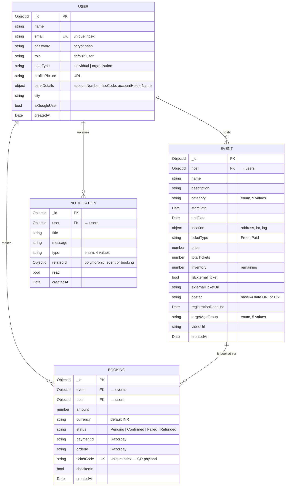

# 2. Database

← [Architecture](./architecture.md) · [Docs index](./README.md) · Next: [Backend](./backend.md)

---

## 2.1 Overview

EventHive uses **MongoDB** accessed through **Mongoose 8** ODM. There are four collections. All
schemas are declared in `backend/src/models/` and are the single source of truth for document
shape — there is no separate migration system, since MongoDB is schema-on-write via Mongoose.

| Collection | Model file | Purpose |
| :--- | :--- | :--- |
| `users` | `User.js` | Accounts — attendees, hosts, and organisations (the same document type) |
| `events` | `Event.js` | Event listings with scheduling, ticketing, and inventory |
| `bookings` | `Booking.js` | A confirmed ticket purchase; carries the QR ticket code and check-in state |
| `notifications` | `Notification.js` | Per-user in-app notification feed |

Connection handling is in `backend/src/config/db.js` — a single `mongoose.connect(process.env.MONGO_URI)`
that logs the host on success and calls `process.exit(1)` on failure, so a misconfigured deployment
fails loudly at boot rather than serving 500s.

---

## 2.2 Entity relationship diagram



---

## 2.3 Collection details

### `users`

`backend/src/models/User.js`

| Field | Type | Constraints | Notes |
| :--- | :--- | :--- | :--- |
| `name` | String | required | |
| `email` | String | required, **unique** | The natural key; the unique constraint creates an index |
| `password` | String | required | Always a bcrypt hash (10 salt rounds). Federated users get a hashed random string so the constraint holds. |
| `role` | String | default `'user'` | **Currently unused** — authorisation is ownership-based |
| `userType` | String | enum `individual` \| `organization`, default `individual` | Drives the "Organization Hosting Mode" affordance in `CreateEventScreen` |
| `profilePicture` | String | default `''` | URL. Seeded users get a DiceBear avatar. |
| `bankDetails` | Object | — | `accountNumber`, `ifscCode`, `accountHolderName` — collected from hosts for payouts |
| `city` | String | default `''` | **Drives notification fan-out** — see [Backend §3.5](./backend.md#35-notification-fan-out) |
| `isGoogleUser` | Boolean | default `false` | |
| `createdAt` | Date | default `Date.now` | |

> **Security note.** `password` is stripped from every response by deleting it from the plain object
> (`delete userResp.password`) or by `.select('-password')`. It is never returned by any endpoint.

### `events`

`backend/src/models/Event.js`

| Field | Type | Constraints | Notes |
| :--- | :--- | :--- | :--- |
| `host` | ObjectId → `User` | required | Ownership key for every privileged operation |
| `name`, `description` | String | required | `description` is excluded from paginated list responses |
| `category` | String | enum | `Music`, `Workshop`, `Meetup`, `Sports`, `Tech`, `Art`, `Cultural`, `Cooking`, `Other` |
| `startDate`, `endDate` | Date | required | `startDate` is the sort key for the feed — **not indexed** |
| `location` | Object | `address` required | `{ address, lat, lng }`. Populated by Google Places autocomplete. |
| `ticketType` | String | enum `Free` \| `Paid`, default `Free` | |
| `price` | Number | default `0` | Forced to `0` when `ticketType === 'Free'` or `isExternalTicket` |
| `totalTickets` | Number | **conditionally** required | `required: function() { return !this.isExternalTicket }` |
| `inventory` | Number | conditionally required | Remaining tickets; initialised to `totalTickets` at creation and decremented on booking |
| `isExternalTicket` | Boolean | default `false` | When true, EventHive lists the event but ticketing happens elsewhere |
| `externalTicketUrl` | String | default `''` | Opened via `Linking.openURL` from the details screen |
| `poster` | String | — | **Stored as a base64 `data:image/jpeg;base64,…` URI** when uploaded from the app; a plain URL when seeded |
| `registrationDeadline` | Date | — | Enforced at both `checkout` and `verify`; must be ≤ `startDate` |
| `targetAgeGroup` | String | enum, default `All Ages` | `All Ages`, `Kids`, `Teens`, `18+`, `21+` |
| `videoUrl` | String | default `''` | Optional intro video; excluded from list responses |

The `totalTickets` / `inventory` pair is a deliberate split: `totalTickets` is the immutable capacity
the host declared, `inventory` is the mutable remaining count. Keeping both means the guest list UI
can show "42 / 250 booked" without a `count()` query.

### `bookings`

`backend/src/models/Booking.js`

| Field | Type | Constraints | Notes |
| :--- | :--- | :--- | :--- |
| `event` | ObjectId → `Event` | required | |
| `user` | ObjectId → `User` | required | |
| `amount` | Number | required | `event.price × quantity` at time of booking, so later price changes don't rewrite history |
| `currency` | String | default `'INR'` | |
| `status` | String | enum, default `Pending` | `Pending`, `Confirmed`, `Failed`, `Refunded`. In practice bookings are written directly as `Confirmed` by `/verify`. |
| `paymentId`, `orderId` | String | — | Razorpay identifiers, or the literal `'FREE'` for free events |
| `ticketCode` | String | **unique** | Generated as `` `${eventId.slice(-4)}-${Date.now()}`.toUpperCase() ``. This string is the QR payload. |
| `checkedIn` | Boolean | default `false` | Flipped once, at the door; a second scan returns 400 |
| `createdAt` | Date | default `Date.now` | Sort key for `my-bookings` (descending) |

> **Note on `ticketCode` uniqueness.** The generator combines the last 4 characters of the event id
> with a millisecond timestamp. Collisions require two bookings for the same event within the same
> millisecond; the unique index makes such a collision a write error rather than a duplicate ticket.

### `notifications`

`backend/src/models/Notification.js`

| Field | Type | Constraints | Notes |
| :--- | :--- | :--- | :--- |
| `user` | ObjectId → `User` | required | Recipient |
| `title`, `message` | String | required | Rendered directly; titles carry an emoji marker per type |
| `type` | String | enum, default `general` | `booking_confirmed`, `check_in`, `event_cancelled`, `general` |
| `relatedId` | ObjectId | — | **Polymorphic** — points at a `Booking` for booking/check-in types, an `Event` for cancellation and city announcements. Deliberately not a `ref`, since the target collection varies by `type`. |
| `read` | Boolean | default `false` | |
| `createdAt` | Date | default `Date.now` | Sort key for the feed (descending) |

---

## 2.4 Relationships and population strategy

All relationships are **references**, not embedded documents. Mongoose `populate()` resolves them
on read:

| Query | Populates | Fields projected |
| :--- | :--- | :--- |
| `GET /api/events` | `host` | `name`, `email`, `profilePicture`, `userType` |
| `GET /api/events/:id` | `host` | `name`, `email`, `profilePicture`, `userType` |
| `GET /api/events/:id/guests` | `user` (on each booking) | `name`, `email`, `profilePicture` |
| `GET /api/bookings/my-bookings` | `event` | *all fields* |
| `POST /api/events/:id/checkin` | `user` (on the booking) | `name`, `email`, `profilePicture` |

Every `populate` call except `my-bookings` uses an explicit field projection, so host records never
leak `password`, `bankDetails`, or `city` into a public response.

**Cost.** Mongoose `populate` issues a **second query** per request. On the events feed this is the
dominant cost under load — see [Testing & Performance §6.4](./testing-and-performance.md#641-bottleneck-analysis).

---

## 2.5 Indexes

Only two indexes exist beyond the automatic `_id`, and both are side effects of `unique: true`:

| Collection | Field | Type | Origin |
| :--- | :--- | :--- | :--- |
| `users` | `email` | unique | `unique: true` in the schema |
| `bookings` | `ticketCode` | unique | `unique: true` in the schema |

### Missing indexes

These are the queries that currently run without index support:

| Query | Fields scanned | Where |
| :--- | :--- | :--- |
| Feed listing sort | `startDate` | `routes/events.js` — `.sort({ startDate: 1 })` on every list request |
| Guest list | `event` | `routes/events.js` — `Booking.find({ event })` |
| Check-in lookup | `event` + `ticketCode` | `routes/events.js` — `Booking.findOne({ event, ticketCode })` |
| My bookings | `user` | `routes/bookings.js` — `Booking.find({ user })` |
| Notification feed | `user` + `createdAt` | `routes/notifications.js` |
| City fan-out | `city` (regex) | `routes/events.js` — `User.find({ city: /…/i })` |

**Recommended additions** (a one-line change per model):

```js
// Event.js — the feed's sort key
EventSchema.index({ startDate: 1 });

// Booking.js — guest list, check-in, and my-bookings
BookingSchema.index({ event: 1, ticketCode: 1 });
BookingSchema.index({ user: 1, createdAt: -1 });

// Notification.js — the notification feed
NotificationSchema.index({ user: 1, createdAt: -1 });
```

At the current data volume (18 seeded events, tens of bookings) collection scans are not the
measured bottleneck — the Atlas network round-trip and the `populate` second query are. These
indexes matter once the collections grow past a few thousand documents.

---

## 2.6 Seeding demo data

`backend/seedEvents.js` provisions a reproducible demo dataset:

- **3 host users** with known credentials (`rohit@example.com` / `rohit123`, `virat@example.com` /
  `virat123`, `jasprit@example.com` / `jasprit123`), each assigned a city so the city-based
  notification fan-out is demonstrable.
- **18 events** spanning every category, mixing free and paid, internal and external ticketing,
  with real Unsplash poster URLs, several with intro videos, varied `targetAgeGroup` values, and
  registration deadlines.

The script is idempotent for users (it reuses an existing account by email) but **additive for
events** — running it twice creates 36 events.

```bash
cd backend
node seedEvents.js
```

---

← [Architecture](./architecture.md) · [Docs index](./README.md) · Next: [Backend](./backend.md)
