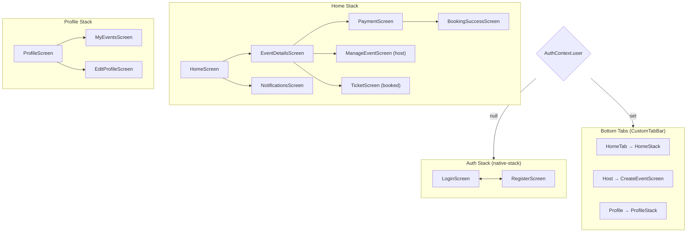

# 5. Mobile App

← [API Reference](./api-reference.md) · [Docs index](./README.md) · Next: [Testing & Performance](./testing-and-performance.md)

---

## 5.1 Stack

| Concern | Choice | Version |
| :--- | :--- | :--- |
| Framework | React Native | 0.81.5 |
| Toolchain | Expo SDK | 54 |
| React | React | 19.1.0 |
| Navigation | React Navigation (native-stack + bottom-tabs) | 7.x |
| Animation | React Native Reanimated | 4.1 |
| HTTP | Axios | 1.13 |
| State | React Context API | — |
| Persistence | AsyncStorage | 2.2 |
| Images | `expo-image` | 3.0 |
| Typography | Plus Jakarta Sans (`@expo-google-fonts`) | — |
| Visual effects | `expo-linear-gradient`, `expo-blur` | — |
| Icons | `lucide-react-native`, `@expo/vector-icons` | — |
| QR | `react-native-qrcode-svg` (generate), `expo-camera` (scan) | — |
| Auth | `expo-auth-session` (Google), `expo-apple-authentication` (Apple) | — |

The New Architecture (Fabric/TurboModules) is enabled via `newArchEnabled: true`, and the React
Compiler is on via `experiments.reactCompiler`.

---

## 5.2 Navigation graph

`src/navigation/AppNavigator.js` switches on `AuthContext.user` — there is no navigation guard on
individual screens, because the unauthenticated and authenticated graphs are entirely separate
trees.



### Tab bar visibility

The tab bar is hidden on immersive screens. `getTabBarVisibility` reads the focused route name out
of the nested stack and returns `'none'` for `EventDetails`, `ManageEvent`, `Ticket`, and
`Notifications`:

```js
const getTabBarVisibility = (route) => {
  const routeName = getFocusedRouteNameFromRoute(route) ?? 'OneEvent';
  return ['EventDetails', 'ManageEvent', 'Ticket', 'Notifications'].includes(routeName) ? 'none' : 'flex';
};
```

`CreateEventScreen` sets `tabBarStyle: { display: 'none' }` unconditionally, so the hosting flow is
full-screen.

---

## 5.3 Screens

| Screen | File | Purpose | API calls |
| :--- | :--- | :--- | :--- |
| **Login** | `LoginScreen.js` | Email/password sign-in, plus Sign in with Apple on iOS only. The `OR` divider and the Apple button are both gated on `Platform.OS === 'ios'`, so Android sees neither. Footer link to Register. See the note below. | via `AuthContext` |
| **Register** | `RegisterScreen.js` | Account creation with `userType` and `city` selection | via `AuthContext` |
| **Home** | `HomeScreen.js` | The discovery feed — featured carousel, search, and four filters | `GET /events?page=1&limit=30` |
| **Event Details** | `EventDetailsScreen.js` | Full event view; the CTA is context-dependent (see below) | `GET /events/:id`, `GET /bookings/my-bookings` |
| **Create Event** | `CreateEventScreen.js` | The hosting form — 776 lines, the largest screen | `POST /events` |
| **Payment** | `PaymentScreen.js` | Two-phase checkout with an offline fallback | `POST /bookings/checkout`, `POST /bookings/verify` |
| **Booking Success** | `BookingSuccessScreen.js` | Post-purchase confirmation | — |
| **Ticket** | `TicketScreen.js` | Renders `ticketCode` as a scannable QR on a notched ticket card | — |
| **Manage Event** | `ManageEventScreen.js` | Host tooling: guest list tab + QR scanner tab | `GET /events/:id/guests`, `POST /events/:id/checkin` |
| **My Events** | `MyEventsScreen.js` | "Attended" and "Hosted" tabs, each split upcoming/past | `GET /events`, `GET /bookings/my-bookings` |
| **Notifications** | `NotificationsScreen.js` | Notification feed (provider currently stubbed — see §5.7) | — |
| **Profile** | `ProfileScreen.js` | Account summary and navigation hub | — |
| **Edit Profile** | `EditProfileScreen.js` | Email, avatar, city, bank details | `PUT /auth/profile` |

> **Google sign-in and guest entry are implemented but unreachable from the UI.** `AuthContext`
> exposes `promptAsync` (Google, via `expo-auth-session`) and `guestLogin`, and `LoginScreen.js`
> defines a `handleGoogleLogin` callback — but **no rendered element invokes any of them**. The
> committed sign-in screen offers email/password and, on iOS, Apple. The server-side handlers
> (`POST /api/auth/google`, `POST /api/auth/apple`) are complete either way. Wiring the Google
> button back up is a UI-only change; guest mode additionally needs a scoped server token, which is
> [Known Limitation #6](./architecture.md#18-known-limitations--future-work). The
> [User Manual §8.9](./user-manual.md) documents the behaviour as shipped.

### Home feed

The feed fetches one page of 30 events and does **all filtering client-side**:

| Filter | Values |
| :--- | :--- |
| City | All Cities, New Delhi, Mumbai, Bengaluru, Pune, Hyderabad, Virtual |
| Category | All + the 9 schema categories |
| Date | All Dates, Today, Tomorrow, This Week, This Month |
| Age group | All Ages, Kids, Teens, 18+, 21+ |
| Text search | free-text over event fields |

Events whose `endDate` has passed are filtered out unconditionally before any user filter applies.

If the request fails **or** returns an empty array, the screen falls back to a three-item
`MOCK_EVENTS` constant so the UI is never empty during a demo without a backend.

### Event details CTA

The primary button resolves through four states:

```
user is the host && !isExternalTicket   → "Manage Event"  → ManageEventScreen
already booked   && !isExternalTicket   → "View Ticket"   → TicketScreen
isExternalTicket                        → "Book on Website" → Linking.openURL(externalTicketUrl)
otherwise                               → inventory > 0 ? "Book Now" → PaymentScreen
                                                        : "Sold Out" (disabled)
```

Booking while logged out redirects to `Login` rather than failing at the API.

### Create Event

The hosting form covers the full `Event` schema: name, description, category, a custom snapping
wheel date-time picker for start/end, Google Places autocomplete for location, free/paid toggle with
price, capacity, poster upload, an optional intro video URL, an external-ticketing mode, an optional
registration deadline, and a target age group.

Posters are picked with `expo-image-picker` at `quality: 0.5`, `aspect: [16, 9]`, `base64: true`,
and submitted as a `data:image/jpeg;base64,…` string. Deadline validity (`deadline ≤ startDate`) is
checked client-side *and* server-side.

Users with `userType === 'organization'` see an additional "Organization Hosting Mode" panel.

### Manage Event

Two tabs:

- **Guest list** — `GET /events/:id/guests`, rendering each attendee with an avatar initial, their
  `ticketCode`, and a check-in status icon.
- **Scanner** — `expo-camera`'s `CameraView` with `useCameraPermissions`. On scan it posts the
  decoded string to `/checkin` and alerts with the attendee's name, offering "Scan Next". A failed
  scan offers "Try Again". The `scanned` flag debounces the camera so one QR fires exactly one
  request.

---

## 5.4 State management

Two React Contexts, both mounted in `App.js` above the navigator.

### `AuthContext`

`src/context/AuthContext.js` owns the session and exposes
`{ user, setUser, loading, login, register, guestLogin, logout, promptAsync, appleLogin }`.

> `guestLogin` and `promptAsync` are exposed here but consumed by no screen — see the note in
> [§5.3](#53-screens).

**Session lifecycle**

```
App launch → loadUser()
  → read 'token' from AsyncStorage
  → set api.defaults.headers.common['x-auth-token']
  → read cached 'userInfo' → setUser(...)
  → setLoading(false)

login / register / Google / Apple
  → POST → { token, user }
  → setUser(user)
  → set the axios default header
  → persist 'token' and 'userInfo'

logout
  → setUser(null)
  → delete the axios default header
  → remove both AsyncStorage keys
```

Attaching the JWT to `api.defaults.headers.common` rather than to each call means every subsequent
request is authenticated without any per-call wiring.

**Performance detail.** The context value is memoised on `[user, loading]`:

```js
const authContextValue = useMemo(() => ({ user, setUser, loading, login, … }), [user, loading]);
```

Without this, every provider render produced a new object identity and re-rendered the entire
navigator tree.

**Google redirect URI.** `makeRedirectUri({ useProxy: true })` is called at **module scope**, not
inside the component — calling it during render caused a re-render loop.

### `NotificationContext`

`src/context/NotificationContext.js` currently returns static empty values and no-op methods. It was
reduced to a stub to eliminate a 10-second polling interval that ran for the entire session,
consuming battery and competing for the JS thread during scrolling. The backend notification API is
fully implemented and covered by 6 integration tests; reconnecting the provider — ideally with
`expo-notifications` push rather than polling — is tracked in
[Architecture §1.8](./architecture.md#18-known-limitations--future-work).

---

## 5.5 API client

`src/services/api.js` exports a configured Axios instance with a 10-second timeout.

The interesting part is base-URL resolution, which has to work across four contexts — a simulator, a
physical device on the same LAN, a web build, and a deployed backend:

```js
const getBaseUrl = () => {
  if (MANUAL_IP) return `http://${MANUAL_IP}:5001/api`;            // 1. manual override

  const expoHostIp = Constants.expoConfig?.hostUri?.split(':')?.shift() || …;
  const envUrl = process.env.EXPO_PUBLIC_API_URL;

  // 2. physical device + a localhost env URL → swap in the Metro host's LAN IP
  if (Platform.OS !== 'web' && expoHostIp && envUrl &&
      (envUrl.includes('localhost') || envUrl.includes('127.0.0.1'))) {
    return envUrl.replace('localhost', expoHostIp).replace('127.0.0.1', expoHostIp);
  }

  if (envUrl) return envUrl;                                        // 3. explicit env (e.g. Render)
  if (Platform.OS === 'web') return 'http://localhost:5001/api';    // 4. web
  if (expoHostIp) return `http://${expoHostIp}:5001/api`;           // 5. derive from Metro
  return 'http://10.0.2.2:5001/api';                                // 6. Android emulator loopback
};
```

Step 2 is what makes `EXPO_PUBLIC_API_URL=http://localhost:5000/api` work on a phone: `localhost` on
a physical device means the phone itself, so the value is rewritten to the development machine's LAN
address, which Expo already knows from `Constants.expoConfig.hostUri`.

Request and response interceptors log method, URL, and status to the Metro console for debugging.

---

## 5.6 Design system

`src/constants/theme.js` holds all design tokens. The visual language is **"Aurora"** — a dark,
glassmorphic, neon-accented theme.

### Colour

```js
primary:    '#00F0FF'   // electric cyan
secondary:  '#00FF94'   // neon green
tertiary:   '#7000FF'   // deep violet

background:   '#050511'                      // near-black blue
surface:      'rgba(20, 20, 35, 0.7)'        // glassmorphism base
surfaceLight: 'rgba(255, 255, 255, 0.1)'

text:    '#FFFFFF'
textDim: 'rgba(255, 255, 255, 0.6)'

success: '#00FF94'   error: '#FF0055'   warning: '#FFCC00'

gradientPrimary:   ['#00C6FF', '#0072FF']
gradientSecondary: ['#11998e', '#38ef7d']
gradientDark:      ['#0f0c29', '#302b63', '#24243e']
```

### Typography

Plus Jakarta Sans across five weights, loaded via `useFonts` in `App.js`. The splash screen is held
with `SplashScreen.preventAutoHideAsync()` until the fonts resolve, so there is no flash of a
fallback face.

| Token | Family | Size | Line height | Tracking |
| :--- | :--- | :--- | :--- | :--- |
| `h1` | ExtraBold | 34 | 40 | −0.5 |
| `h2` | Bold | 24 | 30 | −0.2 |
| `h3` | SemiBold | 20 | 26 | — |
| `body1` | Regular | 16 | 24 | — |
| `body2` | Medium | 14 | 22 | — |
| `body3` | Regular | 12 | 20 | — |

Negative letter-spacing on the display sizes is deliberate — Plus Jakarta Sans tracks loose at
large optical sizes.

### Reusable components

| Component | File | Notes |
| :--- | :--- | :--- |
| `GlassCard` | `components/ui/GlassCard.js` | `expo-blur` + translucent surface — the core glassmorphic primitive |
| `GradientButton` | `components/ui/GradientButton.js` | `expo-linear-gradient` CTA with a disabled grey variant |
| `CustomInput` | `components/ui/CustomInput.js` | Themed text field |
| `CustomTabBar` | `components/CustomTabBar.js` | Custom bottom bar with an elevated centre "Host" action |

> **Note.** The repository root also contains `mobile-app/components/`, `hooks/`, and `constants/` —
> leftover TypeScript scaffolding from `create-expo-app`. The application uses only `mobile-app/src/`.

---

## 5.7 Client-side performance work

Four optimisations were applied after profiling, each addressing a measured symptom.

| # | Change | Symptom addressed | Commit |
| :--- | :--- | :--- | :--- |
| 1 | **Paginate the home feed** — `?page=1&limit=30` instead of fetching every event | Hermes GC pauses of 80–150 ms while parsing a multi-megabyte JSON array, felt as UI freezes | `eb9f587` |
| 2 | **Switch to `expo-image`** with `cachePolicy` and `transition` | React Native's `<Image>` has no disk cache on Android, so posters re-downloaded and re-decoded on every scroll pass | `71dd136` |
| 3 | **Tune Reanimated entrance animations for Android** | `FadeInRight.springify()` ran spring math per list cell on the UI thread; low-end Cortex-A53 cores could not keep the 16 ms frame budget | `e8667ce` |
| 4 | **Stub `NotificationContext`** | A 10-second polling loop woke the JS thread and issued a network request continuously for the whole session | `6387f2e` |

Two structural fixes accompanied them:

- `AuthContext`'s value is memoised, so a provider render no longer re-renders the navigator tree.
- `makeRedirectUri` was hoisted to module scope, removing a render loop in the Google auth setup.

Measured and estimated impact is documented in
[Testing & Performance §6.5](./testing-and-performance.md#65-mobile-client-performance).

---

## 5.8 Configuration

`app.json`:

| Key | Value | Why |
| :--- | :--- | :--- |
| `scheme` | `eventhive` | Deep-link scheme for OAuth redirects |
| `newArchEnabled` | `true` | Fabric renderer + TurboModules |
| `experiments.reactCompiler` | `true` | Automatic memoisation |
| `android.package` | `com.eventhive.mobile` | Must match `APPLE_BUNDLE_ID` on the server for Apple sign-in |
| `plugins → expo-build-properties` | `usesCleartextTraffic: true` | Allows `http://` to a LAN development backend on Android |
| `plugins` | `expo-splash-screen`, `@react-native-community/datetimepicker`, `expo-router` | |

Environment variables (`mobile-app/.env`, all `EXPO_PUBLIC_`-prefixed so they are inlined at build
time):

| Variable | Purpose |
| :--- | :--- |
| `EXPO_PUBLIC_API_URL` | Backend base URL, e.g. `http://localhost:5000/api` |
| `EXPO_PUBLIC_GOOGLE_MAPS_API_KEY` | Google Places autocomplete in `CreateEventScreen` |
| `EXPO_PUBLIC_GOOGLE_CLIENT_ID` | Google OAuth client id |

> `EXPO_PUBLIC_*` values are **embedded in the app bundle** and are not secret. Only
> browser-restricted or public-scope keys belong here.

---

← [API Reference](./api-reference.md) · [Docs index](./README.md) · Next: [Testing & Performance](./testing-and-performance.md)
