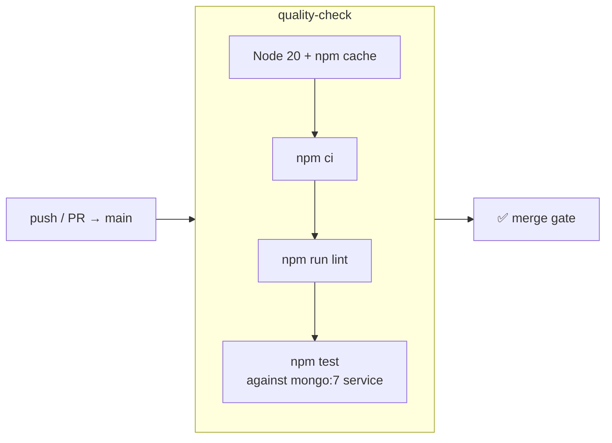

# 7. Setup & Deployment

← [Testing & Performance](./testing-and-performance.md) · [Docs index](./README.md)

---

## 7.1 Prerequisites

| Requirement | Version | Needed for |
| :--- | :--- | :--- |
| Node.js | 18+ (CI and Docker use 20) | Backend and Expo tooling |
| npm | 9+ | Dependency installation |
| MongoDB | 7.x — Atlas cluster or local instance | Backend persistence |
| Expo Go | latest | Running the app on a physical device |
| Docker | optional | Local MongoDB, container build |

Optional service credentials — the project runs without all of them, with the degradations noted:

| Service | Used for | Without it |
| :--- | :--- | :--- |
| Google Cloud (Places API) | Location autocomplete in `CreateEventScreen` | Address must be typed manually |
| Google OAuth client | "Continue with Google" | Email/password sign-in still works |
| Apple Developer | "Sign in with Apple" | Button hidden on non-iOS; email/password still works |
| Razorpay | Payment order creation | Falls back to a mock order outside production |

---

## 7.2 Environment variables

### `backend/.env`

```env
PORT=5000
MONGO_URI=mongodb+srv://<user>:<pass>@<cluster>.mongodb.net/eventhive
JWT_SECRET=<a long random string>

# Optional
NODE_ENV=development
GOOGLE_CLIENT_ID=<google oauth client id>
APPLE_BUNDLE_ID=com.eventhive.mobile
RAZORPAY_KEY_ID=<razorpay key id>
RAZORPAY_KEY_SECRET=<razorpay key secret>
```

| Variable | Required | Notes |
| :--- | :---: | :--- |
| `PORT` | no | Defaults to `5000` |
| `MONGO_URI` | **yes** | `connectDB()` calls `process.exit(1)` if the connection fails |
| `JWT_SECRET` | **yes** | HS256 signing key for all session tokens |
| `NODE_ENV` | no | When not `production`, a Razorpay failure returns a mock order instead of a 500 |
| `GOOGLE_CLIENT_ID` | no | Audience for `verifyIdToken`; falls back to a hardcoded client id |
| `APPLE_BUNDLE_ID` | no | Audience for Apple token verification; defaults to `com.eventhive.mobile` |
| `RAZORPAY_KEY_ID` / `_SECRET` | no | Fall back to placeholders so the server boots without them |

### `mobile-app/.env`

```env
EXPO_PUBLIC_API_URL=http://localhost:5000/api
EXPO_PUBLIC_GOOGLE_MAPS_API_KEY=<google maps / places key>
EXPO_PUBLIC_GOOGLE_CLIENT_ID=<google oauth client id>
```

> **`EXPO_PUBLIC_*` values are inlined into the app bundle at build time and are not secret.** Only
> keys that are safe to ship in a client — referrer-restricted or public-scope — belong here.

`EXPO_PUBLIC_API_URL` can be left pointing at `localhost`: when running on a physical device the
API client automatically substitutes the development machine's LAN IP, which Expo already knows.
See [Mobile App §5.5](./mobile-app.md#55-api-client).

---

## 7.3 Running locally

### 1. Backend

```bash
cd backend
npm install

# create .env as above, then:
npm run dev        # nodemon with reload
# or
npm start          # plain node
```

Expected output:

```
MongoDB Connected: <cluster-host>
Server running on port 5000
Network Accessible at: http://localhost:5000
```

Verify:

```bash
curl http://localhost:5000/health
# {"status":"UP","message":"EventHive Backend is running"}
```

**No MongoDB to hand?** Start one in Docker:

```bash
docker run -d -p 27017:27017 --name eventhive-mongo mongo:7
# then set MONGO_URI=mongodb://localhost:27017/eventhive
```

### 2. Seed demo data

```bash
cd backend
node seedEvents.js
```

Creates 3 host accounts and 18 events across every category — free and paid, internal and external
ticketing, with posters, videos, deadlines, and varied age groups. The three hosts are assigned
cities so the city-based notification fan-out is demonstrable.

| Email | Password | City |
| :--- | :--- | :--- |
| `rohit@example.com` | `rohit123` | Bengaluru |
| `virat@example.com` | `virat123` | Mumbai |
| `jasprit@example.com` | `jasprit123` | Mumbai |

> The script reuses existing users by email but **always appends events** — running it twice
> produces 36 events.

### 3. Mobile app

```bash
cd mobile-app
npm install

# create .env as above, then:
npx expo start
```

Scan the QR code with **Expo Go** (Android) or the Camera app (iOS). Both devices must be on the
same network as the machine running the backend.

| Command | Target |
| :--- | :--- |
| `npm start` | Metro bundler + QR code |
| `npm run android` | Android emulator / connected device |
| `npm run ios` | iOS simulator |
| `npm run web` | Browser |
| `npm run lint` | ESLint via `expo lint` |

### Demo walkthrough

A path that exercises every major feature:

1. **Register** a new account with a city of `Bengaluru`.
2. **Browse** the seeded feed; apply the city, category, date, and age filters.
3. **Open** an event and book a free ticket → confirmation → **QR ticket**.
4. **Host** a new event from the centre tab, with a poster and a Bengaluru address.
5. **Sign in** as `rohit@example.com` — the new event triggers a city notification.
6. Open your hosted event → **Manage Event** → scan the attendee's QR from the other device.
7. Observe the check-in notifications on both sides and the updated guest list.

---

## 7.4 Docker

`backend/Dockerfile`:

```dockerfile
FROM node:20-alpine
WORKDIR /app
COPY package*.json ./
RUN npm install -g npm@latest && npm ci --only=production && npm uninstall -g npm
COPY . .
EXPOSE 5000
CMD ["node", "src/server.js"]
```

Notes on the choices: `node:20-alpine` keeps the image small and shrinks the attack surface;
`npm ci --only=production` skips the ~200 MB of dev dependencies; copying `package*.json` before the
source keeps the dependency layer cached across source changes.

```bash
cd backend
docker build -t eventhive-backend .

docker run -p 5000:5000 \
  -e MONGO_URI="mongodb+srv://…" \
  -e JWT_SECRET="…" \
  eventhive-backend
```

---

## 7.5 CI pipeline

`.github/workflows/ci.yml` — triggered on push and pull request to `main`. A single job,
`quality-check`, with two sequential gates.



### `quality-check`

Runs on every push **and** pull request. Provisions an ephemeral MongoDB as a service container:

```yaml
services:
  mongodb:
    image: mongo:7
    ports: [ 27017:27017 ]
    options: >-
      --health-cmd "mongosh --quiet --eval 'db.runCommand({ ping: 1 })'"
      --health-interval 10s --health-timeout 5s --health-retries 10
```

The health check matters: without it the test job can start before `mongod` is accepting
connections, producing intermittent failures unrelated to the code. Tests then run against
`mongodb://localhost:27017/eventhive_test` with `JWT_SECRET: ci_test_secret`.

Gates: **ESLint must pass**, then **all 16 tests must pass**.

### Why containerisation is not in CI

The `Dockerfile` and the Kubernetes manifests are maintained in the repository but are **not** built
or applied by the pipeline. An earlier revision of this workflow carried `build-and-push` (Docker
build → Trivy scan → Docker Hub) and `deploy` (kind cluster → `kubectl apply`) jobs, but they
depended on `DOCKERHUB_USERNAME` and `DOCKERHUB_TOKEN` repository secrets that are not configured.
Without them `docker/login-action` fails with `Username and password required`, which failed the
whole run on every push even though lint and the tests had passed.

Removing those jobs makes the pipeline report the thing it can actually verify — code quality —
rather than a permanent red cross caused by absent credentials. Build and deploy the container
manually (§7.4 and §7.6), or restore the jobs once the secrets are added to the repository.

---

## 7.6 Kubernetes

`backend/k8s/deployment.yaml` — 2 replicas:

```yaml
spec:
  replicas: 2
  template:
    spec:
      containers:
      - name: eventhive-backend
        image: 7arj/eventhive-backend:latest
        imagePullPolicy: Always
        ports: [ { containerPort: 5000 } ]
        env:
        - { name: MONGO_URI, value: "mongodb://host.docker.internal:27017/eventhive" }
        - { name: PORT, value: "5000" }
        resources:
          limits: { memory: "256Mi", cpu: "500m" }
```

`backend/k8s/service.yaml` — a `LoadBalancer` exposing port 80 → container port 5000.

```bash
kubectl apply -f backend/k8s/deployment.yaml
kubectl apply -f backend/k8s/service.yaml

kubectl get pods -l app=eventhive-backend
kubectl get svc eventhive-service
```

### Issues to address before real use

> **1. `memory: 256Mi` is below the observed floor.** The load benchmark measured an RSS floor of
> **211.72 MB** and a peak of **298.23 MB** (see
> [Testing §6.4](./testing-and-performance.md#memory)). Pods would be OOM-killed under the load
> tested. Raise the limit to at least `512Mi`.
>
> **2. `MONGO_URI` and `JWT_SECRET` are inline, not secrets.** `MONGO_URI` is hardcoded in the
> manifest and `JWT_SECRET` is absent entirely — the pods cannot sign tokens. Both should come from
> a `Secret`:
>
> ```yaml
> env:
>   - name: MONGO_URI
>     valueFrom: { secretKeyRef: { name: eventhive-secrets, key: mongo-uri } }
>   - name: JWT_SECRET
>     valueFrom: { secretKeyRef: { name: eventhive-secrets, key: jwt-secret } }
> ```
>
> **3. No probes are declared.** `/health` exists and is ideal for both:
>
> ```yaml
> livenessProbe:
>   httpGet: { path: /health, port: 5000 }
>   initialDelaySeconds: 10
> readinessProbe:
>   httpGet: { path: /health, port: 5000 }
>   initialDelaySeconds: 5
> ```
>
> Without a readiness probe, traffic reaches a pod before its MongoDB connection is established.

---

## 7.7 Render deployment

The backend is also deployed as a Render Web Service at
`https://eventhive-l9j5.onrender.com`.

| Setting | Value |
| :--- | :--- |
| Root directory | `backend` |
| Build command | `npm install` |
| Start command | `npm start` |
| Environment | `MONGO_URI`, `JWT_SECRET`, and any optional keys, set in the Render dashboard |

To point the mobile app at it:

```env
EXPO_PUBLIC_API_URL=https://eventhive-l9j5.onrender.com/api
```

### Cold starts

Render's free tier sleeps a service after ~15 minutes of inactivity, and the next request pays a
multi-second wake-up — long enough to trip the client's 10-second Axios timeout during a live demo.
`backend/keep_alive.js` prevents this by pinging `/health` every 10 minutes:

```bash
cd backend
node keep_alive.js
```

```
Starting Keep-Alive for: https://eventhive-l9j5.onrender.com/health
[14:32:01] Ping Status: 200
```

Run it in a spare terminal before any evaluation or demo.

---

## 7.8 Troubleshooting

| Symptom | Cause | Fix |
| :--- | :--- | :--- |
| `Error: <reason>` then the process exits at boot | `MONGO_URI` missing or unreachable | `connectDB()` exits deliberately on failure. Check the URI and that your IP is allow-listed in Atlas. |
| App shows mock events instead of seeded ones | The feed request failed or returned `[]` | Check the `API BASE_URL configured as:` line in the Metro console; confirm the backend is reachable from the phone. |
| `Network request failed` on a physical device | The phone cannot reach the dev machine | Same Wi-Fi network; set `MANUAL_IP` in `src/services/api.js` as a last resort. |
| Every authenticated call returns 401 | Missing or expired token | Tokens last 5 days. Log out and back in. Note that **guest mode has no server session** — any authenticated call as a guest will 401. |
| `Registration deadline must be before…` | Deadline set after `startDate` | Validated on both client and server. |
| Notification bell always shows zero | `NotificationContext` is intentionally stubbed | Expected. See [Architecture §1.8](./architecture.md#18-known-limitations--future-work), item 7. |
| CI fails at "Run Unit Tests" | The `mongo:7` service was not ready | The health check should prevent this; re-run the job. |
| CI fails at "Login to Docker Hub" | `DOCKERHUB_*` secrets are not configured | The Docker/k8s jobs were removed for this reason; see §7.5. |
| First API call after idle times out | Render cold start | Run `node keep_alive.js`. |

---

← [Testing & Performance](./testing-and-performance.md) · [Docs index](./README.md)
